# Practica 2.2

## Introduccion
 En esta practica vamos a tratar la autenticacion de usuario a nuestro servidor web antes de que pueda acceder a ello, y ademas permitir y bloquear ips especificas.


## Paquetes necesarios

Primero verificamos que el paquete esta instalado del openSSL, con el comando <br>

```
dpkg -l | grep openssl
```

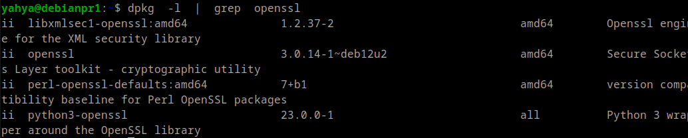


## Creación de usuarios y contraseñas para el acceso web

Crearemos un archivo oculto llamado “.htpasswd” en el directorio de configuración /etc/nginx donde guardar nuestros usuarios y contraseñas (la -c es para crear el archivo):

```
sudo sh -c "echo -n 'Yahya:' >> /etc/nginx/.htpasswd"
```

Ahora crearemos un pasword cifrado para el usuario:

```
sudo sh -c "openssl passwd -apr1 >> /etc/nginx/.htpasswd"
```

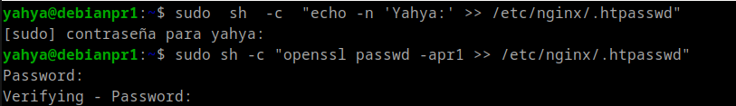


Hcemos lo mismo para el usuario ```Limouni```<br>

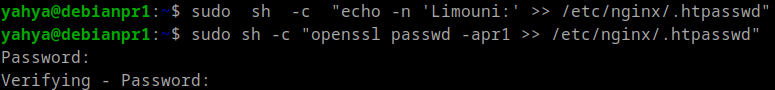

Comprobar el archivo .htpasswd <br>
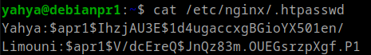 <br>

## Configurando el servidor Nginx para usar autenticación básica
Accedemos al archivo de configuracion de nuestra web <br>

```sudo nano /etc/nginx/sites-available/practica2.conf```

Debemos decidir qué recursos estarán protegidos. Nginx permite añadir restricciones a nivel de servidor o en un location (directorio o archivo) específico. Para nuestro ejemplo, vamos a proteger el document root (la raíz, la página principal) de nuestro sitio.

Utilizaremos la directiva auth_basic dentro del location y le pondremos el nombre a nuestro dominio que será mostrado al usuario al solicitar las credenciales. Por último, configuramos Nginx para que utilice el fichero que previamente hemos creado con la directiva auth_basic_user_file

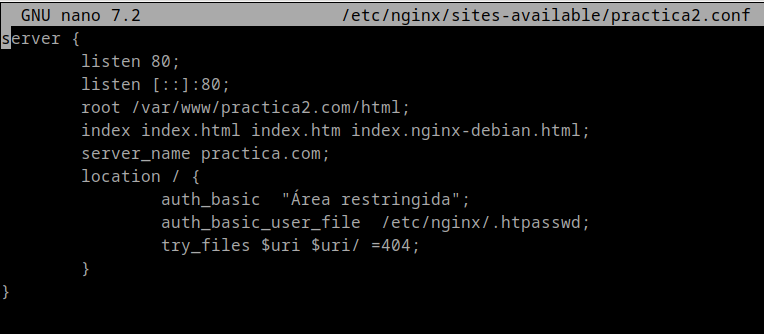

Reiniciamos Nginx: <br>

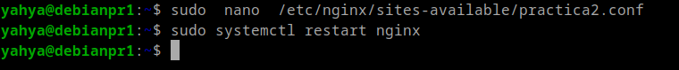

Intentamos autenticarnos con un usuario erroneo: <br>

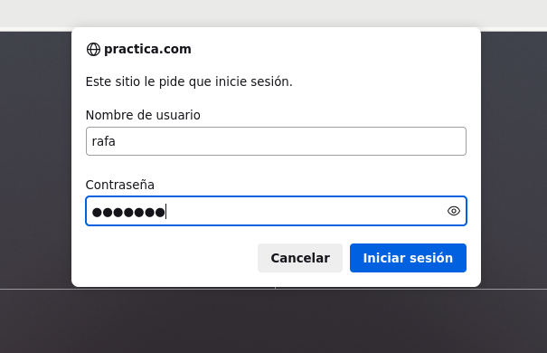


Y ahora con el usuario Yahya (correcto):

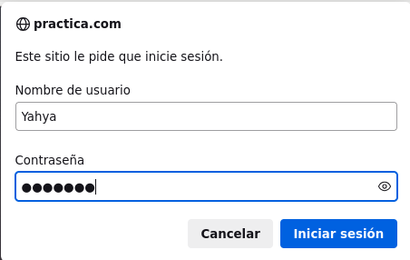

Verificamos las peticiones GET realizadas<br>
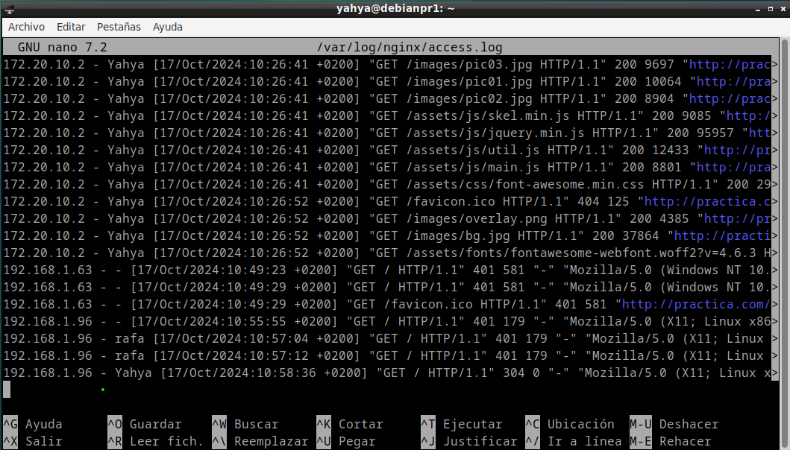

Y ahora las Peticiones que no han tenido exito <br>
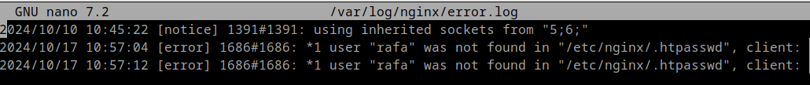

## Configurando el servidor Nginx para usar autenticación básica a una pagina especifica (```contacto.html```)

Establecimos la autenticacion a la pagina contacto.html <br>                 
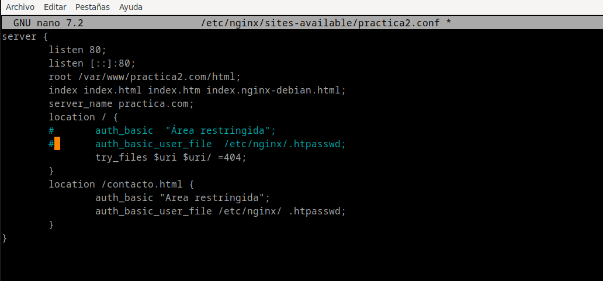

Demostracion: <br>
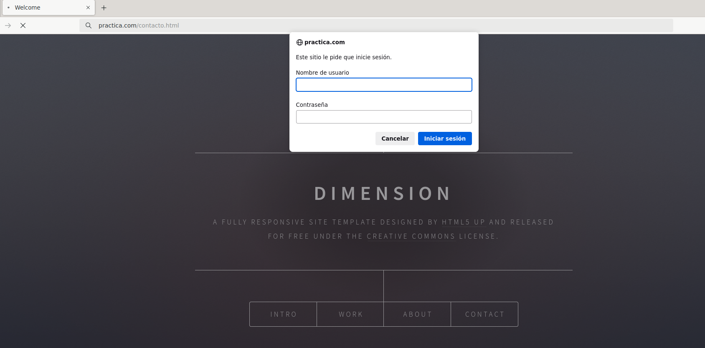

## Configurar Nginx para que no deje acceder con la IP de la máquina anfitriona al directorio raíz
En mi caso he puesto que no deje acceder con las IPs de la red local: <br>
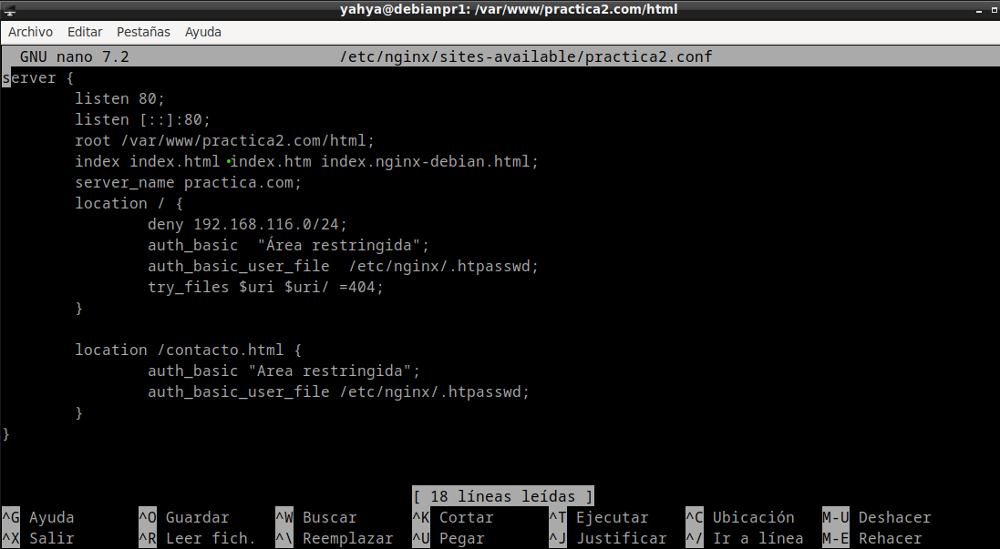

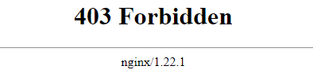

                                     
## Configurar Nginx para que desde la máquina anfitriona se tenga que tener tanto una IP válida como un usuario válido, ambas cosas a la vez

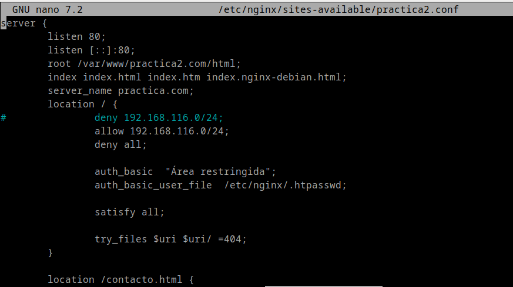

## Cuestiones finales:
### Supongamos que yo soy el cliente con la IP 172.1.10.15 e intento acceder al directorio web_muy_guay de mi sitio web, equivocándome al poner el usuario y contraseña. ¿Podré acceder?¿Por qué?

```
    location /web_muy_guay {
    #...
    satisfy all;    
    deny  172.1.10.6;
    allow 172.1.10.15;
    allow 172.1.3.14;
    deny  all;
    auth_basic "Cuestión final 1";
    auth_basic_user_file conf/htpasswd;
}
```

-> En este caso no se puede, porque hay que satisfacer las doz condiciones, IP valida y usuario correcto.


### ask "Cuestión 1" Supongamos que yo soy el cliente con la IP 172.1.10.15 e intento acceder al directorio web_muy_guay de mi sitio web, introduciendo correctamente usuario y contraseña. ¿Podré acceder?¿Por qué?
```
    location /web_muy_guay {
    #...
    satisfy all;    
    deny  all;
    deny  172.1.10.6;
    allow 172.1.10.15;
    allow 172.1.3.14;

    auth_basic "Cuestión final 2: The revenge";
    auth_basic_user_file conf/htpasswd;
}
```

-> No porque el orden importa, el deny all va al final.

### Supongamos que yo soy el cliente con la IP 172.1.10.15 e intento acceder al directorio web_muy_guay de mi sitio web, introduciendo correctamente usuario y contraseña. ¿Podré acceder?¿Por qué?
```
    location /web_muy_guay {
    #...
    satisfy any;    
    deny  172.1.10.6;
    deny 172.1.10.15;
    allow 172.1.3.14;

    auth_basic "Cuestión final 3: The final combat";
    auth_basic_user_file conf/htpasswd;
}
```
-> No porque esta prohibido el acceso con el ```deny``` <br>

### Supongamos que quiero restringir el acceso al directorio de proyectos porque es muy secreto, eso quiere decir añadir autenticación básica a la URL:Proyectos

Completa la configuración para conseguirlo:

```
    server {
        listen 80;
        listen [::]:80;
        root /var/www/freewebsitetemplates.com/preview/space-science;
        index index.html index.htm index.nginx-debian.html;
        server_name freewebsitetemplates.com www.freewebsitetemplates.com;
        location   {

            try_files $uri $uri/ =404;
        }
        location   /proyectos   {
            auth_basic "Cuestión final 3: The final combat";
            auth_basic_user_file conf/htpasswd;
            try_files $uri $uri/ =404;
        }
    }
```
